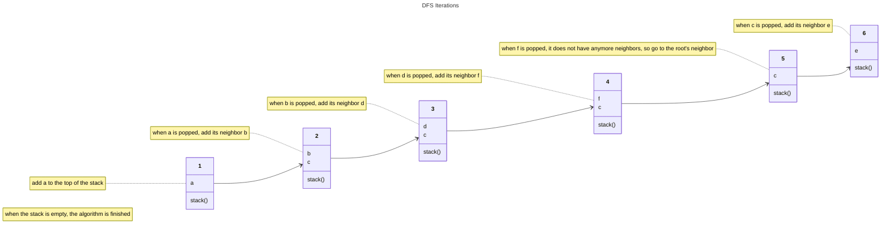

## Graphs

### Basics
- Graphs are known as nodes and edges
    - Nodes are values
    - Edges are connections to nodes (Connection between a pair of nodes)

- Directed graphs force us to traverse in the direction given
- Undirected graphs allow us to traverse to any neighbor

- Adjacency List
    - Usually a hashmap to show the relationship nodes have, example:

```js
{
    a: [b, c],  // Node a can traverse either node b or c
    b: [d],     // Node b can traverse to node d
    c: [e],     // Node c can traverse to node e
    d: [],      // Node d does not have a relationship with another node
    e: [b],     // Node e can traverse to node b
    f: [d],     // Node f can traverse to node f
}
```
Imagine the value pair being the neighboring nodes to the key

### Depth First Traversal
- Traverse vertically, meaning that you will only traverse through a node's neighbors until it doesn't have one, starting at the root
- Explore one direction as far as possible


#### Implementation
- Depth First
  - Implements with a stack, last in first out
  - When removing a node at the top of the stack, the neighboring nodes will be added to the top



> **NOTE** This ultimately prints a, b, d, f, c, e
#### Code
Iteratively: 
```js
const depthFirstPrint = (graph, source) => {
    const stack = [source];

    while (stack.length > 0) {
      const currentNode = stack.pop(); // Removes last index

      console.log(currentNode);

      for (let neighbor of graph[current]) {
        stack.push(neighbor); // Adds to the back of the array
      };
    };
};
```
Recursively:
```js
// Does not have an explicit base case,
// Implicit base case is when a node has empty neighbors and cannot be iterated
const depthFirstPrint = (graph, source) => {
    console.log(source);

    for (let neighbor of graph[source]) {
        depthFirstPrint(graph, neighbor);
    };
};
```

- Usage notes:
```js
// Example of using this for both iteratively and recursively:

const graph = {
    a: [b, c],
    b: [d],
    c: [e],
    d: [],
    e: [b],
    f: [d],
}

// Source is where we want to start
depthFirstPrint(graph, 'a');
``` 

### Breadth First Traversal
  - Traverse horizontally, meaning that you must traverse through a node's neighbors at the same time before going to the next set of neighbors
  - Explore node neighbors evenly


#### Implementation
- Breadth First
  - Implements with a queue, first in first out
  - When removing the first node, its neighboring nodes will be added to the end of the queue


> **NOTE** This ultimately prints a, b, c, d, e, f

#### Code
Iteratively:
```js
const breadthFirstPrint = (graph, source) => {
    const queue = [source];

    while (queue.length > 0) {
        const currentNode = queue.shift(); // Removes index 0
        
        console.log(currentNode);

        for (let neighbor of graph[currentNode]) {
            queue.push(neighbor); // Adds to end of the array
        };
    };
};

// Example of using this:

const graph = {
    a: [b, c],
    b: [d],
    c: [e],
    d: [],
    e: [b],
    f: [d],
}

// Source is where we want to start
breadthFirstPrint(graph, 'a');
```
