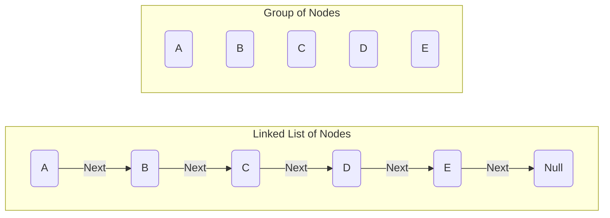

# Linked Lists

## Basics
- A node is a container that can hold any type of value such as strings, booleans, objects, etc
- Linked lists are a collection of nodes that are linked together by pointers
    - Lists are ordered
    - These pointers point to the direction of the next value in the list
        - In addition to the value the node holds, it can also contain other properties, such as which node it is pointing to
    - If we are at the end, a node will point to "nothing", because well, it literally has nothing to point to

- There are some terms used for linked lists, such as:
    - Head - First node in the list
    - Tail - Last node in the list that points to null



### Linked Lists vs Arrays
- Linked lists are a collection of nodes, whereas arrays are a collection of elements
- Arrays must be contiguous in memory, meaning a system must allocate enough space sequentially for each element
- Linked lists do not have to be contiguous and the system does not need to allocate space sequentially for the next node
- An example of how a linked list could perform better:  
    - Given an array, we want to delete or insert an element in the middle.
To do this, we would either have to move every element after up an index or down an index.
If we were to do this for a linked lists, we could simply change the node's next value before where we want to insert the node to the new node,
then point this new node to the previous node's next.

## Linked List Traversal
- When accessing a linked list in a function, we would only need to pass in the "head" node of the linked list
    - The reason behind this is because the head contains the value for the next value

### Implementations

```js
// Create the structure for a node
class Node {
    constructor(value) {
        this.value = value;
        this.next = null;
    }
}

// Initializing a group of nodes
const a = new Node('A');
const b = new Node('B');
const c = new Node('C');
const d = new Node('D');
const e = new Node('E');

// Linking the nodes together
a.next = b;
b.next = c;
c.next = d;
d.next = e;
```

- Iterative implementation

```js
const logLinkedList = (head) => {
    let current = head;

    // This will end when we hit the next value for E, which is null
    // If we were to check if current.next !== null, we would not be able to print E
    // The loop will break because E's next value is null

    // Tip, try to be as present as possible when traversing a list
    while (current !== null) {
        console.log(current.value);

        // Update what current is pointing to
        current = current.next
    }
}

logLinkedList(head);
// A --> B --> C --> D --> E --> null
```

- Recursive implementation

```js
const logLinkedList = (head) => {
    if (head == null) {
        return
    }

    console.log(head.value);

    logLinkedList(head.next);
}

logLinkedList(head);
// A --> B --> C --> D --> E --> null
```